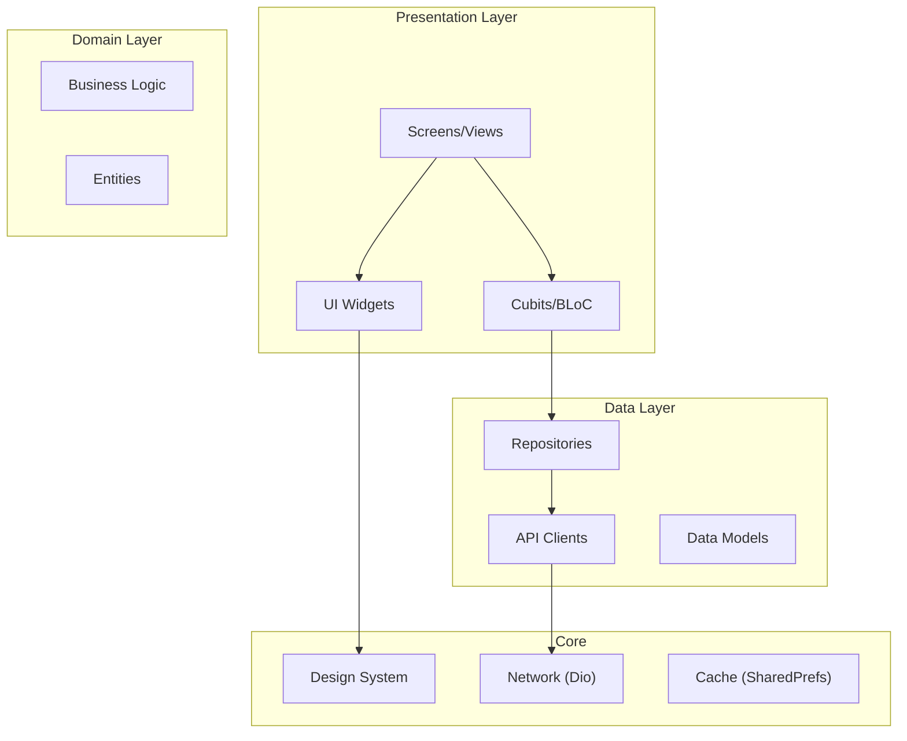

# ASD SmartCare

<!-- Badges -->
[](https://github.com/AHMED9937/ASD-SmartCare-Graduation-Project/actions/workflows/flutter-ci-cd.yml)
[](https://codecov.io/gh/AHMED9937/ASD-SmartCare-Graduation-Project)
[](https://github.com/AHMED9937/ASD-SmartCare-Graduation-Project/actions)
[](https://flutter.dev)
[](https://dart.dev)
[](https://github.com/AHMED9937/ASD-SmartCare-Graduation-Project/releases)
[](LICENSE)
[](https://github.com/AHMED9937/ASD-SmartCare-Graduation-Project/graphs/commit-activity)

A cross-platform Flutter mobile application designed to support autism assessment and care management for children with Autism Spectrum Disorders (ASD).

---

## Table of Contents

- [Overview](#overview)
- [Motivation](#motivation)
- [Features](#features)
- [Architecture](#architecture)
- [Prerequisites](#prerequisites)
- [Getting Started](#getting-started)
- [Running Tests](#running-tests)
- [Configuration](#configuration)
- [Docker](#docker)
- [Deployment](#deployment)
- [Project Structure](#project-structure)
- [Demo](#demo)
- [Troubleshooting](#troubleshooting)
- [Contributing](#contributing)
- [Acknowledgements](#acknowledgements)
- [License](#license)

---

## Overview

**ASD SmartCare** is a comprehensive mobile application that bridges the gap between autism specialists (doctors) and caregivers (parents). It provides AI-powered autism screening, specialist booking, session tracking, and educational resources—all in one platform.

📥 **[Download the APK](https://drive.google.com/file/d/1cRxrZ3s-ED3sZGo-PKvzXYpOMsQg_nf3/view)**

## Motivation

Early detection and continuous care are critical for children with autism. This project was developed to:

1. **Democratize Access**: Provide an accessible screening tool for families who may not have immediate access to specialists
2. **Streamline Care Coordination**: Connect parents with qualified autism specialists and track progress over time
3. **Leverage AI**: Use machine learning models for preliminary autism screening through Q&A interactions
4. **Educate Caregivers**: Provide resources, articles, and guidance for families navigating autism care

---

## Features

| Feature | Description |
|---------|-------------|
| 🔐 **Two-Role Authentication** | Separate flows for Doctors and Parents with secure login/signup |
| 🤖 **AI-Powered Screening** | Conversational Q&A system for preliminary autism assessment |
| 💬 **Autism Chatbot** | NLP-based assistant for autism-related questions |
| 👨‍⚕️ **Doctor Booking** | Browse specialists, view availability, book appointments |
| 💳 **Stripe Payments** | Secure payment integration for consultations |
| 📊 **Progress Tracking** | Specialists log session outcomes; parents track child development |
| 📚 **Educational Hub** | Articles and resources for autism care |
| 💊 **Medicine Guide** | Pharmacy suggestions and prescription management |
| 🎗️ **Charity Section** | Connect with nonprofit autism associations |

---

## Architecture

The application follows **Clean Architecture** with a layered design:



**Key Patterns:**
- **State Management**: Cubit/BLoC with sealed classes for type-safe states
- **Repository Pattern**: Abstraction over API calls with error mapping
- **Design System**: Centralized tokens (colors, typography, spacing)
- **Routing**: Navigator 1.0 with centralized route table

> 📖 See [docs/architecture.md](docs/architecture.md) for detailed architecture documentation.

---

## Prerequisites

| Requirement | Version |
|-------------|---------|
| Flutter SDK | ≥ 3.32.0 |
| Dart SDK | ≥ 3.5.0 |
| Android SDK | API 21+ (Android 5.0+) |
| Java | JDK 17 |
| Git | Latest |

**Optional:**
- Android Studio / VS Code with Flutter extension
- Xcode (for iOS builds on macOS)
- Docker (for containerized builds)

---

## Getting Started

### 1. Clone the Repository

```bash
git clone https://github.com/AHMED9937/ASD-SmartCare-Graduation-Project.git
cd ASD-SmartCare-Graduation-Project
```

### 2. Install Dependencies

```bash
flutter pub get
```

### 3. Configure Environment

```bash
# Copy the example environment file
cp .env.example .env

# Edit .env with your API keys (see Configuration section)
```

### 4. Run the Application

```bash
# Run on connected device/emulator
flutter run

# Run with specific Dart defines (if not using .env)
flutter run --dart-define=API_BASE_URL=https://your-api.com/ \
            --dart-define=STRIPE_PUBLISHABLE_KEY=pk_test_xxx
```

---

## Running Tests

The project includes **69+ test files** covering unit, widget, and repository tests.

### Run All Tests

```bash
flutter test
```

### Run with Coverage

```bash
# Generate coverage report
flutter test --coverage

# View coverage summary (requires lcov)
lcov --summary coverage/lcov.info

# Generate HTML report
genhtml coverage/lcov.info -o coverage/html
open coverage/html/index.html
```

### Run Specific Test File

```bash
flutter test test/parent/find_doctors/booking/booking_cubit_test.dart
```

### Test Categories

| Category | Location | Count |
|----------|----------|-------|
| Unit Tests | `test/**/controllers/` | 45+ |
| Widget Tests | `test/**/views/` | 20+ |
| Repository Tests | `test/**/data/` | 10+ |

---

## Configuration

### Environment Variables

Create a `.env` file in the project root (see `.env.example`):

| Variable | Description | Required |
|----------|-------------|----------|
| `API_BASE_URL` | Backend API base URL | Yes |
| `STRIPE_PUBLISHABLE_KEY` | Stripe public key | Yes |
| `STRIPE_SECRET_KEY` | Stripe secret key | Yes |

### Dart Defines (Alternative)

Pass configuration at build time:

```bash
flutter run \
  --dart-define=API_BASE_URL=https://api.example.com/ \
  --dart-define=STRIPE_PUBLISHABLE_KEY=pk_test_xxx \
  --dart-define=STRIPE_SECRET_KEY=sk_test_xxx
```

---

## Docker

A Docker environment is provided for consistent, reproducible builds across all machines. This is ideal for CI/CD pipelines and ensuring team consistency.

### Prerequisites

| Requirement | Minimum Version | Notes |
|-------------|-----------------|-------|
| Docker Desktop | 4.0+ | [Download](https://www.docker.com/products/docker-desktop/) |
| Docker Engine | 20.10+ | (Included with Docker Desktop) |
| Docker Compose | 2.0+ | (Included with Docker Desktop) |
| Disk Space | 10GB+ | For Flutter SDK and Android SDK |

> [!TIP]
> On Windows, ensure Docker Desktop is set to use Linux containers (default setting).

---

### Option 1: Using Docker Compose (Recommended)

Docker Compose provides predefined configurations for common tasks.

#### Build the Docker Image

```bash
docker compose build
```

#### Run All Tests

```bash
docker compose up test
```

#### Run Static Analysis

```bash
docker compose up analyze
```

#### Build Release APK

```bash
docker compose up build

# APK location: ./build/app/outputs/flutter-apk/app-release.apk
```

#### Build App Bundle (for Play Store)

```bash
docker compose up build-aab

# AAB location: ./build/app/outputs/bundle/release/app-release.aab
```

#### Interactive Development Shell

```bash
docker compose run --rm flutter bash
```

#### Run Custom Flutter Command

```bash
docker compose run --rm flutter flutter doctor -v
docker compose run --rm flutter flutter test test/parent/home/home_cubit_test.dart
```

---

### Option 2: Using Docker CLI

For more control, use Docker commands directly.

#### Build the Docker Image

```bash
# Standard build
docker build -t asd-smartcare-build .

# Build with verbose output (for debugging)
docker build -t asd-smartcare-build --progress=plain .

# Build with no cache (fresh build)
docker build -t asd-smartcare-build --no-cache .
```

#### Run Tests

```bash
# Run all tests (default command)
docker run --rm asd-smartcare-build

# Run tests with coverage
docker run --rm asd-smartcare-build flutter test --coverage

# Run specific test file
docker run --rm asd-smartcare-build flutter test test/parent/home/home_cubit_test.dart
```

#### Run Static Analysis

```bash
docker run --rm asd-smartcare-build flutter analyze
```

#### Build Release APK

<details>
<summary><strong>Linux / macOS</strong></summary>

```bash
docker run --rm -v $(pwd)/build:/app/build asd-smartcare-build flutter build apk --release
```
</details>

<details>
<summary><strong>Windows PowerShell</strong></summary>

```powershell
docker run --rm -v ${PWD}/build:/app/build asd-smartcare-build flutter build apk --release
```
</details>

<details>
<summary><strong>Windows Command Prompt</strong></summary>

```cmd
docker run --rm -v %cd%/build:/app/build asd-smartcare-build flutter build apk --release
```
</details>

**APK Output Location:** `./build/app/outputs/flutter-apk/app-release.apk`

#### Build App Bundle (for Google Play)

```bash
# Linux/macOS
docker run --rm -v $(pwd)/build:/app/build asd-smartcare-build flutter build appbundle --release

# Windows PowerShell
docker run --rm -v ${PWD}/build:/app/build asd-smartcare-build flutter build appbundle --release
```

**AAB Output Location:** `./build/app/outputs/bundle/release/app-release.aab`

#### Interactive Shell (for debugging)

```bash
docker run --rm -it asd-smartcare-build bash

# Inside container, you can run any Flutter command:
flutter doctor -v
flutter test
flutter build apk --release
```

---

### Extracting Build Artifacts

After building inside Docker, artifacts are automatically available on your host machine via volume mounting.

| Artifact | Path on Host Machine |
|----------|---------------------|
| Release APK | `./build/app/outputs/flutter-apk/app-release.apk` |
| Debug APK | `./build/app/outputs/flutter-apk/app-debug.apk` |
| App Bundle (AAB) | `./build/app/outputs/bundle/release/app-release.aab` |
| Coverage Report | `./coverage/lcov.info` |

**Manual Copy from Running Container:**

```bash
# Copy APK from a named container
docker cp asd-smartcare-build-apk:/app/build/app/outputs/flutter-apk/app-release.apk ./my-app.apk
```

---

### Docker Troubleshooting

<details>
<summary><strong>Build fails with "no space left on device"</strong></summary>

```bash
# Clean up Docker resources
docker system prune -a
docker volume prune
```
</details>

<details>
<summary><strong>Build is very slow</strong></summary>

Ensure Docker has sufficient resources:
- Memory: 6GB minimum (8GB recommended)
- CPUs: 4+ cores recommended

On Docker Desktop: Settings → Resources → Adjust sliders
</details>

<details>
<summary><strong>Volume mounting issues on Windows</strong></summary>

Ensure the drive is shared with Docker:
1. Docker Desktop → Settings → Resources → File Sharing
2. Add the drive containing your project
3. Restart Docker Desktop
</details>

<details>
<summary><strong>Rebuild from scratch</strong></summary>

```bash
# Using Docker Compose
docker compose down -v
docker compose build --no-cache

# Using Docker CLI
docker rmi asd-smartcare-build
docker build --no-cache -t asd-smartcare-build .
```
</details>

---

> 📖 See [README_DOCKER.md](README_DOCKER.md) for complete Docker documentation including CI/CD integration, troubleshooting, and advanced usage.

---

## Deployment

### CI/CD Pipeline

GitHub Actions automatically runs on every push/PR:

1. **Format Check** - Ensures code formatting consistency
2. **Static Analysis** - Catches potential issues
3. **Tests** - Runs all unit and widget tests
4. **Build** - Builds debug APK and web
5. **Deploy** - Uploads to Firebase App Distribution (main branch only)

### Manual Deployment

```bash
# Build release APK
flutter build apk --release

# Build release App Bundle (for Play Store)
flutter build appbundle --release
```

> 📖 See [DEPLOYMENT.md](DEPLOYMENT.md) for complete deployment instructions including Firebase setup and signing configuration.

---

## Project Structure

```
lib/
├── app/
│   └── router/              # Centralized routing
├── core/
│   ├── cache/               # SharedPreferences helper
│   ├── design_system/       # Tokens (colors, typography, spacing)
│   ├── network/             # Dio client, API constants
│   ├── state/               # App-level cubits
│   ├── ui/                  # Shared UI components
│   └── utils/               # Utilities
├── doctor/                  # Doctor-specific features
│   ├── account/             # Profile management
│   ├── appointments/        # Appointment management
│   ├── clinic/              # Availability settings
│   ├── home/                # Dashboard
│   ├── my_patients/         # Patient list
│   ├── navigation/          # Bottom nav
│   └── sessions/            # Session management
├── parent/                  # Parent-specific features
│   ├── account/             # Profile management
│   ├── chatbot/             # AI chatbot
│   ├── education/           # Educational articles
│   ├── find_doctors/        # Doctor search & booking
│   ├── home/                # Dashboard
│   ├── my_children/         # Children management
│   ├── navigation/          # Bottom nav
│   ├── progress/            # Progress tracking
│   └── screening/           # Autism screening tests
├── shared/                  # Shared across roles
│   ├── auth/                # Login, signup, password reset
│   ├── donations/           # Charity features
│   └── medicines/           # Medicine guide
└── main.dart                # App entry point

test/                        # Mirror structure of lib/
```

---

## Demo

### Sample Workflows

**Parent Flow:**
1. Login → Home Screen
2. "AI Test" → Record responses → Submit → View autism screening results
3. "Doctors" → Browse specialists → Book appointment → Pay via Stripe
4. "Progress" → View session history and child development

**Doctor Flow:**
1. Login → Dashboard with stats
2. "Patients" → View registered children
3. "Sessions" → Log session outcomes and feedback
4. "Clinic" → Set availability schedule

### Screenshots

<!-- Add screenshots here when available -->
*Screenshots coming soon*

---

## Troubleshooting

### Common Issues

<details>
<summary><strong>Flutter SDK not found</strong></summary>

Ensure Flutter is in your PATH:
```bash
export PATH="$PATH:/path/to/flutter/bin"
flutter doctor
```
</details>

<details>
<summary><strong>Android SDK not found</strong></summary>

Set ANDROID_HOME environment variable:
```bash
export ANDROID_HOME=$HOME/Android/Sdk
export PATH=$PATH:$ANDROID_HOME/emulator
export PATH=$PATH:$ANDROID_HOME/platform-tools
```
</details>

<details>
<summary><strong>Gradle build fails</strong></summary>

Try cleaning and rebuilding:
```bash
cd android && ./gradlew clean && cd ..
flutter clean
flutter pub get
flutter run
```
</details>

<details>
<summary><strong>iOS build fails on macOS</strong></summary>

Update CocoaPods and install dependencies:
```bash
cd ios
pod deintegrate
pod install --repo-update
cd ..
flutter run
```
</details>

<details>
<summary><strong>Tests fail with module not found</strong></summary>

Regenerate generated files:
```bash
flutter pub get
dart run build_runner build --delete-conflicting-outputs
```
</details>

---

## Contributing

We welcome contributions! Please see [CONTRIBUTING.md](CONTRIBUTING.md) for:

- Development workflow
- Code style guidelines
- How to run tests before submitting PRs
- Commit message format (Conventional Commits)

---

## Acknowledgements

### Team

- **Ahmed** - Lead Developer
- Graduation Project Team - Al-Azhar University

### Technologies

- [Flutter](https://flutter.dev) - UI framework
- [flutter_bloc](https://pub.dev/packages/flutter_bloc) - State management
- [Dio](https://pub.dev/packages/dio) - HTTP client
- [Stripe](https://stripe.com) - Payment processing
- [mocktail](https://pub.dev/packages/mocktail) - Testing mocks

### Resources

- [Flutter Documentation](https://docs.flutter.dev/)
- [Effective Dart](https://dart.dev/guides/language/effective-dart)
- [BLoC Library](https://bloclibrary.dev/)

---

## License

This project is licensed under the MIT License - see the [LICENSE](LICENSE) file for details.

---

<p align="center">
  Made with ❤️ for autism awareness and support
</p>
