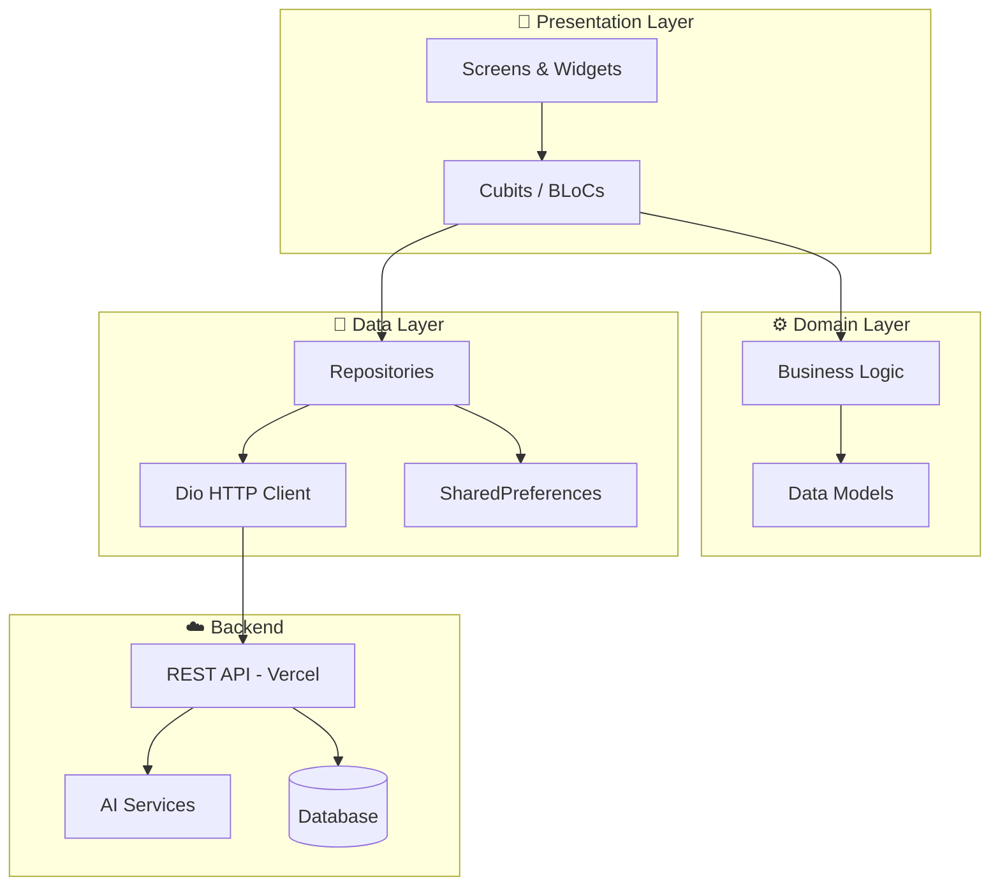
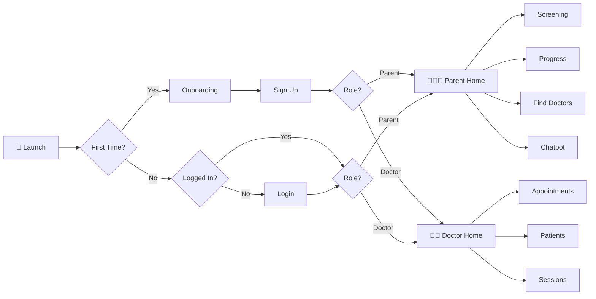
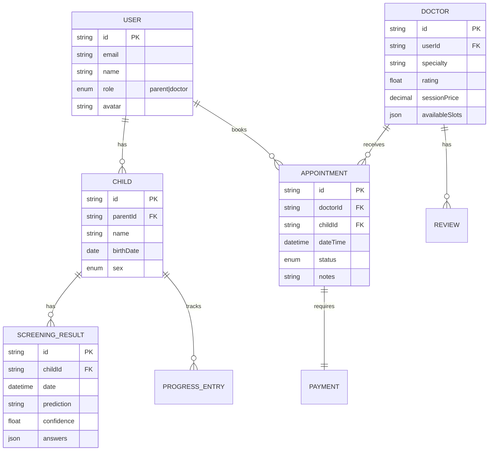

<p align="center">
  
</p>

<h1 align="center">ASD SmartCare</h1>

<p align="center">
  <strong>AI-Powered Support for Families Affected by Autism Spectrum Disorder</strong>
</p>

<p align="center">
  
  
  
  
</p>

<p align="center">
  <a href="https://github.com/AHMED9937/ASD-SmartCare-Graduation-Project/actions/workflows/flutter-ci-cd.yml">
    
  </a>
  <a href="https://codecov.io/gh/AHMED9937/ASD-SmartCare-Graduation-Project">
    
  </a>
  <a href="https://github.com/AHMED9937/ASD-SmartCare-Graduation-Project/releases">
    
  </a>
</p>

---

## 📋 Table of Contents

- [Overview](#-overview)
- [The Problem We Solve](#-the-problem-we-solve)
- [Features](#-features)
- [Architecture](#-architecture)
- [Prerequisites](#-prerequisites)
- [Getting Started](#-getting-started)
- [Running Locally](#-running-locally)
- [Quick Demo](#-quick-demo)
- [Testing](#-testing)
- [Project Structure](#-project-structure)
- [Configuration](#-configuration)
- [Contributing](#-contributing)
- [Acknowledgements](#-acknowledgements)
- [License](#-license)

---

## 🌟 Overview

**ASD SmartCare** is a comprehensive mobile application designed to support families navigating the challenges of Autism Spectrum Disorder. The app bridges the gap between parents, healthcare professionals, and educational resources through AI-powered tools and intuitive design.

### Why This Project?

Early intervention is critical for children with ASD. However, many families face barriers:
- Long wait times for professional diagnosis
- Limited access to specialized therapists
- Difficulty tracking developmental progress
- Lack of reliable information sources

ASD SmartCare addresses these challenges by providing accessible screening tools, professional connections, and ongoing support—all in one platform.

---

## 🎯 The Problem We Solve

| Challenge | Our Solution |
|-----------|--------------|
| **Limited Screening Access** | AI-powered questionnaires for preliminary autism assessment |
| **Finding Specialists** | Directory of specialized doctors with online booking |
| **Tracking Progress** | Visual progress dashboards for cognitive, social, and daily living skills |
| **Information Gaps** | Educational articles and AI chatbot for instant answers |
| **Support Networks** | Connection to autism-related charities and resources |

### Who Benefits?

- **Parents** seeking early screening and developmental tracking
- **Doctors/Therapists** managing patient appointments and sessions
- **Children** through age-appropriate interactive features

---

## ✨ Features

### For Parents
- 🧩 **ASD Screening Tests** - Two-tier assessment: symptom detection + severity level
- 📊 **Progress Tracking** - Monitor child development with visual charts
- 🤖 **AI Chatbot** - Get instant answers about autism-related topics
- 👨‍⚕️ **Find Doctors** - Browse and book appointments with specialists
- 📚 **Education Hub** - Access curated articles and resources
- 💊 **Medicine Guide** - Information about common treatments
- 💝 **Charity Connect** - Discover and support autism organizations

### For Doctors
- 📅 **Appointment Management** - Set availability and manage bookings
- 👥 **Patient Dashboard** - View registered children and their progress
- 📝 **Session Notes** - Document and track therapy sessions
- ⭐ **Reviews & Ratings** - Build reputation through patient feedback
- 🏥 **Clinic Profile** - Manage practice information

---

## 🏗 Architecture

The app follows a **layered architecture** with clear separation of concerns:



### State Management

We use **Cubit** (from `flutter_bloc`) with **sealed classes** for type-safe state handling:

```dart
sealed class ScreeningState {}
final class ScreeningInitial extends ScreeningState {}
final class ScreeningLoading extends ScreeningState {}
final class ScreeningSuccess extends ScreeningState { final Result result; }
final class ScreeningError extends ScreeningState { final String message; }
```

### User Flow



### Data Model (ERD)



> 📖 See [docs/ARCHITECTURE.md](docs/architecture.md) for detailed architecture documentation.

---

## 📋 Prerequisites

Before you begin, ensure you have the following installed:

| Requirement | Version | Check Command |
|-------------|---------|---------------|
| Flutter SDK | ^3.5.4 | `flutter --version` |
| Dart SDK | ^3.5.4 | `dart --version` |
| Android Studio | Latest | Required for Android builds |
| Xcode | Latest | Required for iOS builds (macOS only) |
| Git | Latest | `git --version` |

### Additional Requirements

- **Java JDK 17+** (for Android builds)
- **CocoaPods** (for iOS: `sudo gem install cocoapods`)
- **Stripe Account** (for payment features)

---

## 🚀 Getting Started

### Step 1: Clone the Repository

```bash
git clone https://github.com/AHMED9937/ASD-SmartCare-Graduation-Project.git
cd ASD-SmartCare-Graduation-Project
```

### Step 2: Install Dependencies

```bash
flutter pub get
```

### Step 3: Configure Environment Variables

```bash
# Copy the example environment file
cp .env.example .env

# Edit with your values
# Required: API_BASE_URL, STRIPE_PUBLISHABLE_KEY
```

> ⚠️ **Never commit `.env` to version control!**

### Step 4: Run the App

```bash
# For development
flutter run

# Or specify a device
flutter run -d chrome    # Web (limited support)
flutter run -d android   # Android emulator
flutter run -d ios       # iOS simulator
```

---

## 📱 Running Locally

### Android Emulator

```bash
# List available devices
flutter devices

# Run on Android
flutter run -d android

# Run with hot reload enabled (default)
flutter run -d android --debug
```

### iOS Simulator (macOS only)

```bash
# Install iOS dependencies
cd ios && pod install && cd ..

# Run on iOS
flutter run -d ios
```

### Physical Device

```bash
# Enable USB debugging on your device, then:
flutter run

# For release build on device
flutter run --release
```

### Environment Switching

```bash
# Development (default)
flutter run

# With custom API URL
flutter run --dart-define=API_BASE_URL=https://your-api.com/

# Production build
flutter build apk --release \
  --dart-define=API_BASE_URL=https://production-api.com/ \
  --dart-define=STRIPE_PUBLISHABLE_KEY=pk_live_xxx
```

---

## 🎮 Quick Demo

### 1. Parent Registration Flow

After launching the app:
1. Swipe through the **onboarding screens**
2. Tap **"Get Started"**
3. Select **"I'm a Parent"**
4. Fill in registration details
5. Verify email with OTP code

### 2. Taking an ASD Screening Test

```
Home Screen → "Autism Test" Card → Start Test

The test presents 9 structured questions:
├── Q1: Child's age
├── Q2: Child's sex
├── Q3-Q8: Behavioral observations (text responses)
└── Q9: Additional challenges

→ AI analyzes responses
→ Returns severity prediction
```

**Sample API Request:**
```json
POST /api/v1/ai/finalPredication_degree
{
  "index": 8,
  "answer": "No additional challenges noted"
}
```

**Sample Response:**
```json
{
  "degree_prediction": "Mild ASD Traits",
  "confidence": 0.85,
  "recommendations": [
    "Consider professional evaluation",
    "Monitor social interactions"
  ]
}
```

### 3. Booking a Doctor Appointment

```
Home → "Find Doctors" → Select Doctor → View Available Slots → Book

Payment processed via Stripe → Confirmation received
```

### 4. AI Chatbot Interaction

```
Home → "Chatbot" → Type question

Example:
User: "What are early signs of autism?"
Bot: "Early signs may include limited eye contact, 
      delayed speech, repetitive behaviors..."
```

---

## 🧪 Testing

### Run All Tests

```bash
flutter test
```

### Run Specific Test Directory

```bash
# Unit tests for parent features
flutter test test/parent/

# Doctor feature tests  
flutter test test/doctor/

# Core/shared tests
flutter test test/core/
```

### Run with Coverage

```bash
# Generate coverage report
flutter test --coverage

# View HTML report (requires lcov)
genhtml coverage/lcov.info -o coverage/html
open coverage/html/index.html
```

### Test Structure

```
test/
├── app/               # Router tests
├── core/              # Design system, network tests
├── doctor/            # Doctor feature tests
├── parent/            # Parent feature tests
│   ├── screening/     # Screening cubit tests
│   ├── progress/      # Progress tracking tests
│   └── ...
├── shared/            # Auth, common tests
└── widget_test.dart   # Basic widget test
```

> 📖 See [docs/TESTING.md](docs/TESTING.md) for detailed testing guide.

---

## 📁 Project Structure

```
ASD-SmartCare-Graduation-Project/
├── 📁 lib/
│   ├── 📁 app/
│   │   └── router/              # Centralized navigation
│   ├── 📁 appassets/
│   │   └── images/              # App images and icons
│   ├── 📁 core/
│   │   ├── cache/               # SharedPreferences helpers
│   │   ├── design_system/       # Theme, colors, typography
│   │   ├── di/                  # Dependency injection
│   │   ├── network/             # Dio client, API constants
│   │   ├── state/               # App-wide cubits
│   │   ├── ui/                  # Shared UI components
│   │   └── utils/               # Helper utilities
│   ├── 📁 doctor/
│   │   ├── account/             # Doctor profile management
│   │   ├── appointments/        # Availability & bookings
│   │   ├── clinic/              # Clinic information
│   │   ├── home/                # Doctor dashboard
│   │   ├── my_patients/         # Patient list
│   │   ├── navigation/          # Bottom navigation
│   │   └── sessions/            # Therapy sessions
│   ├── 📁 parent/
│   │   ├── account/             # Parent profile
│   │   ├── chatbot/             # AI chat interface
│   │   ├── education/           # Articles & resources
│   │   ├── find_doctors/        # Doctor discovery
│   │   ├── home/                # Parent dashboard
│   │   ├── my_children/         # Children management
│   │   ├── navigation/          # Bottom navigation
│   │   ├── progress/            # Development tracking
│   │   └── screening/           # ASD tests
│   ├── 📁 shared/
│   │   ├── auth/                # Login, signup, onboarding
│   │   ├── donations/           # Charity features
│   │   ├── medicines/           # Medicine information
│   │   └── widgets/             # Shared widgets
│   └── main.dart                # App entry point
├── 📁 test/                     # Test files (mirrors lib/)
├── 📁 docs/                     # Documentation
├── 📁 android/                  # Android platform code
├── 📁 ios/                      # iOS platform code
├── pubspec.yaml                 # Dependencies
├── .env.example                 # Environment template
└── README.md                    # This file
```

---

## ⚙️ Configuration

### Environment Variables

| Variable | Required | Description |
|----------|----------|-------------|
| `API_BASE_URL` | Yes | Backend API base URL |
| `STRIPE_PUBLISHABLE_KEY` | Yes | Stripe public key (pk_xxx) |
| `STRIPE_SECRET_KEY` | No | Server-side only |

### Configuration Methods

**Option 1: `.env` file (Development)**
```bash
cp .env.example .env
# Edit .env with your values
```

**Option 2: `--dart-define` (CI/CD)**
```bash
flutter run \
  --dart-define=API_BASE_URL=https://api.example.com/ \
  --dart-define=STRIPE_PUBLISHABLE_KEY=pk_test_xxx
```

**Option 3: GitHub Actions Secrets**

Configure in repository settings → Secrets:
- `API_BASE_URL`
- `STRIPE_PUBLISHABLE_KEY`
- `KEYSTORE_BASE64` (for signed APK builds)

> 📖 See [docs/GITHUB_SECRETS.md](docs/GITHUB_SECRETS.md) for CI/CD configuration.

---

## 🤝 Contributing

We welcome contributions! Please follow these steps:

1. **Fork** the repository
2. **Create** a feature branch: `git checkout -b feature/amazing-feature`
3. **Commit** your changes: `git commit -m 'feat: add amazing feature'`
4. **Push** to the branch: `git push origin feature/amazing-feature`
5. **Open** a Pull Request

### Code Quality Requirements

Before submitting:
```bash
# Run analysis
flutter analyze

# Format code
dart format .

# Run tests
flutter test
```

> 📖 See [docs/CONTRIBUTING.md](docs/CONTRIBUTING.md) for detailed guidelines.  
> 📖 See [CODE_QUALITY.md](CODE_QUALITY.md) for coding standards.

---

## 🙏 Acknowledgements

### Open Source Libraries

| Library | Purpose | Docs |
|---------|---------|------|
| [flutter_bloc](https://bloclibrary.dev/) | State management | [Documentation](https://bloclibrary.dev/) |
| [dio](https://pub.dev/packages/dio) | HTTP client | [Documentation](https://pub.dev/packages/dio) |
| [flutter_stripe](https://pub.dev/packages/flutter_stripe) | Payment processing | [Documentation](https://stripe.com/docs) |
| [freezed](https://pub.dev/packages/freezed) | Code generation | [Documentation](https://pub.dev/packages/freezed) |

### Resources

- [Flutter Documentation](https://docs.flutter.dev/)
- [Effective Dart](https://dart.dev/guides/language/effective-dart)
- [Autism Speaks - What is Autism?](https://www.autismspeaks.org/what-autism)
- [CDC Autism Resources](https://www.cdc.gov/ncbddd/autism/)

### Team

Built as a graduation project with ❤️ for the ASD community.

---

## 📄 License

This project is licensed under the MIT License - see the [LICENSE](LICENSE) file for details.

---

<p align="center">
  <sub>Made with Flutter 💙</sub>
</p>
