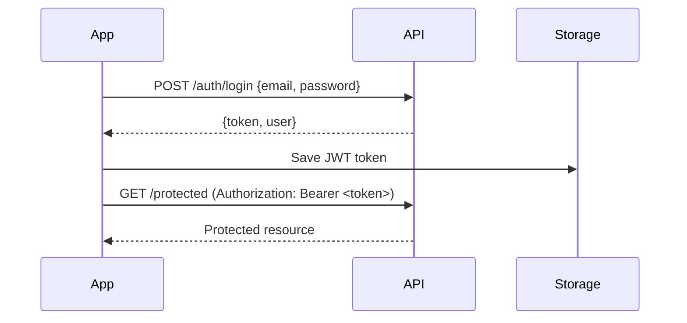

# API Reference

Backend API documentation for ASD SmartCare integration.

---

## Table of Contents

- [Overview](#overview)
- [Configuration](#configuration)
- [Authentication](#authentication)
- [Endpoints](#endpoints)
  - [Auth](#auth-endpoints)
  - [AI/Screening](#aiscreening-endpoints)
  - [Doctors](#doctor-endpoints)
  - [Appointments](#appointment-endpoints)
  - [Education](#education-endpoints)
- [Error Handling](#error-handling)
- [Data Models](#data-models)

---

## Overview

The ASD SmartCare app communicates with a REST API hosted on Vercel.

| Property | Value |
|----------|-------|
| Base URL | `https://asdproject-two.vercel.app/` |
| Protocol | HTTPS |
| Format | JSON |
| Auth | JWT Bearer Token |

### HTTP Client

The app uses **Dio** with **Retrofit** for type-safe API calls:

```dart
// lib/core/network/dio_helper.dart
final dio = Dio(BaseOptions(
  baseUrl: ApiConstants.baseUrl,
  connectTimeout: const Duration(seconds: 30),
  receiveTimeout: const Duration(seconds: 30),
));
```

---

## Configuration

### Environment Variables

| Variable | Required | Description |
|----------|----------|-------------|
| `API_BASE_URL` | Yes | Backend API base URL |
| `STRIPE_PUBLISHABLE_KEY` | Yes | Stripe public key for payments |

### Setting Up

```bash
# Option 1: .env file
cp .env.example .env
# Edit .env with your values

# Option 2: dart-define (CI/CD)
flutter run --dart-define=API_BASE_URL=https://your-api.com/
```

---

## Authentication

### JWT Token Flow



### Token Storage

Tokens are stored securely using `SharedPreferences`:

```dart
// Save token
await CacheHelper.saveData(key: 'token', value: token);

// Get token
final token = CacheHelper.getData(key: 'token');
```

### Request Headers

All authenticated requests include:

```http
Authorization: Bearer <jwt_token>
Content-Type: application/json
```

---

## Endpoints

### Auth Endpoints

#### `POST /auth/register`

Register a new user (parent or doctor).

**Request:**
```json
{
  "email": "user@example.com",
  "password": "securePassword123",
  "name": "John Doe",
  "role": "parent"
}
```

**Response (Success):**
```json
{
  "success": true,
  "message": "Registration successful",
  "data": {
    "userId": "abc123",
    "email": "user@example.com"
  }
}
```

---

#### `POST /auth/login`

Authenticate a user.

**Request:**
```json
{
  "email": "user@example.com",
  "password": "securePassword123"
}
```

**Response:**
```json
{
  "success": true,
  "token": "eyJhbGciOiJIUzI1NiIs...",
  "user": {
    "id": "abc123",
    "email": "user@example.com",
    "name": "John Doe",
    "role": "parent"
  }
}
```

---

#### `POST /auth/verify-otp`

Verify email with OTP code.

**Request:**
```json
{
  "email": "user@example.com",
  "otp": "123456"
}
```

---

### AI/Screening Endpoints

#### `POST /api/v1/ai/predict`

Submit screening answers for ASD detection.

**Request:**
```json
{
  "answers": [
    {"questionId": 1, "answer": "Sometimes"},
    {"questionId": 2, "answer": "Rarely"}
  ]
}
```

**Response:**
```json
{
  "success": true,
  "prediction": {
    "hasTraits": true,
    "confidence": 0.78,
    "recommendation": "Consider professional evaluation"
  }
}
```

---

#### `POST /api/v1/ai/finalPredication_degree`

Get severity level prediction after full assessment.

**Request:**
```json
{
  "index": 8,
  "answer": "No additional challenges noted"
}
```

**Response:**
```json
{
  "degree_prediction": "Mild ASD Traits",
  "confidence": 0.85,
  "recommendations": [
    "Consider professional evaluation",
    "Monitor social interactions"
  ]
}
```

---

### Doctor Endpoints

#### `GET /api/v1/doctors`

List available doctors.

**Query Parameters:**
| Param | Type | Description |
|-------|------|-------------|
| `specialty` | string | Filter by specialty |
| `rating` | number | Minimum rating |
| `page` | number | Pagination page |

**Response:**
```json
{
  "success": true,
  "data": [
    {
      "id": "doc123",
      "name": "Dr. Sarah Smith",
      "specialty": "Pediatric Psychiatry",
      "rating": 4.8,
      "reviewCount": 124,
      "avatar": "https://..."
    }
  ],
  "pagination": {
    "page": 1,
    "totalPages": 5
  }
}
```

---

#### `GET /api/v1/doctors/:id`

Get doctor details.

**Response:**
```json
{
  "id": "doc123",
  "name": "Dr. Sarah Smith",
  "specialty": "Pediatric Psychiatry",
  "bio": "Specialized in autism spectrum...",
  "education": ["MD - Harvard Medical School"],
  "experience": 15,
  "rating": 4.8,
  "sessionPrice": 150,
  "availableSlots": ["2024-01-15T10:00:00Z"]
}
```

---

### Appointment Endpoints

#### `POST /api/v1/appointments`

Book an appointment.

**Request:**
```json
{
  "doctorId": "doc123",
  "childId": "child456",
  "slotDateTime": "2024-01-15T10:00:00Z",
  "notes": "First consultation"
}
```

**Response:**
```json
{
  "success": true,
  "appointment": {
    "id": "apt789",
    "status": "pending_payment",
    "paymentUrl": "https://checkout.stripe.com/..."
  }
}
```

---

#### `GET /api/v1/appointments`

List user's appointments.

**Response:**
```json
{
  "upcoming": [
    {
      "id": "apt789",
      "doctorName": "Dr. Sarah Smith",
      "dateTime": "2024-01-15T10:00:00Z",
      "status": "confirmed"
    }
  ],
  "past": []
}
```

---

### Education Endpoints

#### `GET /api/v1/articles`

List educational articles.

**Response:**
```json
{
  "articles": [
    {
      "id": "art001",
      "title": "Understanding ASD Early Signs",
      "summary": "Learn about the early indicators...",
      "imageUrl": "https://...",
      "readTime": 5
    }
  ]
}
```

---

## Error Handling

### Error Response Format

```json
{
  "success": false,
  "error": {
    "code": "VALIDATION_ERROR",
    "message": "Invalid email format",
    "details": {
      "field": "email"
    }
  }
}
```

### Common Error Codes

| Code | HTTP Status | Description |
|------|-------------|-------------|
| `UNAUTHORIZED` | 401 | Invalid or expired token |
| `FORBIDDEN` | 403 | Insufficient permissions |
| `NOT_FOUND` | 404 | Resource not found |
| `VALIDATION_ERROR` | 400 | Invalid request data |
| `SERVER_ERROR` | 500 | Internal server error |

### Client-Side Handling

```dart
try {
  final response = await api.login(email, password);
  emit(LoginSuccess(response.user));
} on DioException catch (e) {
  final message = _parseError(e);
  emit(LoginError(message));
}

String _parseError(DioException e) {
  switch (e.response?.statusCode) {
    case 401:
      return 'Invalid email or password';
    case 404:
      return 'User not found';
    default:
      return 'Something went wrong. Please try again.';
  }
}
```

---

## Data Models

### User Model

```dart
class User {
  final String id;
  final String email;
  final String name;
  final String role; // 'parent' | 'doctor'
  final String? avatar;
}
```

### Doctor Model

```dart
class Doctor {
  final String id;
  final String name;
  final String specialty;
  final double rating;
  final int reviewCount;
  final double sessionPrice;
  final List<String> availableSlots;
}
```

### Appointment Model

```dart
class Appointment {
  final String id;
  final String doctorId;
  final String childId;
  final DateTime dateTime;
  final String status; // 'pending' | 'confirmed' | 'completed' | 'cancelled'
  final String? notes;
}
```

---

## Rate Limiting

| Endpoint Category | Limit |
|-------------------|-------|
| Auth endpoints | 10 req/min |
| AI/Screening | 5 req/min |
| General API | 60 req/min |

---

## Related Documentation

- [ARCHITECTURE.md](architecture.md) - System architecture
- [TROUBLESHOOTING.md](TROUBLESHOOTING.md) - Common issues
- [GITHUB_SECRETS.md](GITHUB_SECRETS.md) - Secrets configuration
