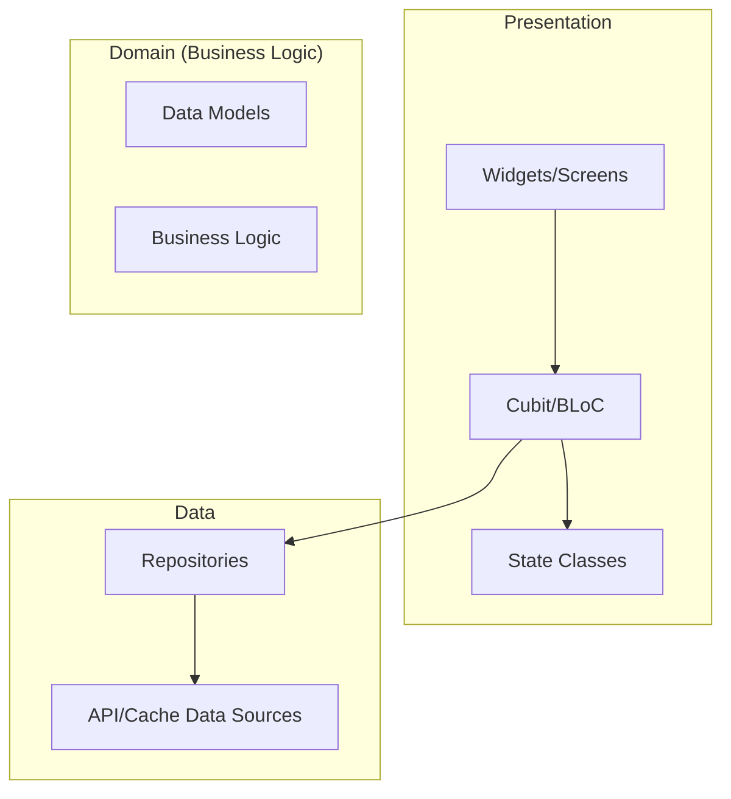
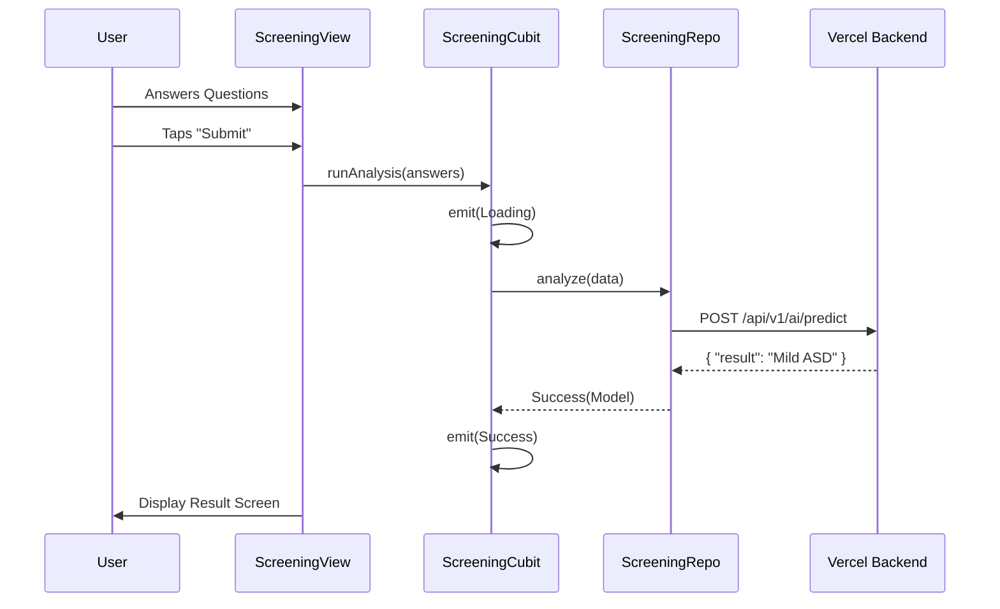
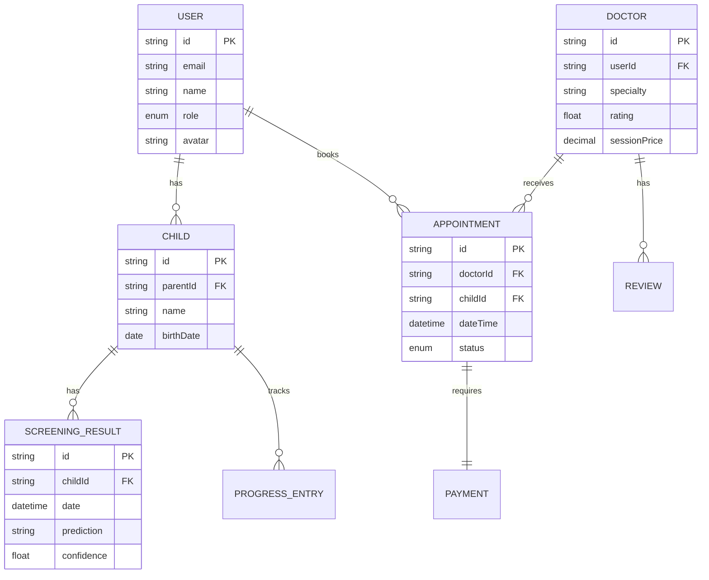

# System Architecture

This document provides a technical deep-dive into the ASD SmartCare application architecture, design patterns, and core systems.

---

## High-Level Overview

ASD SmartCare is built with Flutter using a **Layered Architecture** (Clean Architecture inspired) to ensure scalability, testability, and maintainability.



---

## Architectural Layers

### 1. Presentation Layer
- **Location**: `lib/**/views/` and `lib/**/controllers/`
- **Responsibilities**: 
    - Rendering the UI using Flutter widgets.
    - Handling user interactions.
    - Managing UI state via Cubits.
- **Pattern**: BLoC/Cubit for state management. Every feature module has a `controllers/` folder containing its logic.

### 2. Domain/Data Layer
- **Location**: `lib/**/models/` and `lib/core/network/`
- **Responsibilities**:
    - Defining data structures (Models).
    - Coordinating data flow between the UI and external services (Repositories).
    - Interfacing with REST APIs and local storage.

---

## Core Systems

### State Management: Cubit
We use `flutter_bloc`'s Cubit for its simplicity and reactivity. Each feature state is defined using **Sealed Classes** (available in Dart 3.0+) for type safety.

```dart
// Example: lib/parent/screening/test/controllers/autism_checker_state.dart
sealed class AutismCheckerState {}
final class AutismCheckerInitial extends AutismCheckerState {}
final class AutismCheckerLoading extends AutismCheckerState {}
final class AutismCheckerSuccess extends AutismCheckerState {
  final PredictionModel result;
  AutismCheckerSuccess(this.result);
}
```

### Dependency Injection
- **Service Locator**: [GetIt](https://pub.dev/packages/get_it) is used to register and inject singleton instances of services, repositories, and helpers.
- **Location**: `lib/core/di/di.dart`

### Networking
- **Engine**: [Dio](https://pub.dev/packages/dio) with [Retrofit](https://pub.dev/packages/retrofit).
- **Interceptors**: Custom interceptors for logging and adding authentication tokens (`lib/core/network/dio_helper.dart`).
- **Constants**: All endpoints are centralized in `lib/core/network/api_constants.dart`.

---

## Design System

The app utilizes a centralized design system to maintain visual consistency.

### 1. Tokens
Located in `lib/core/design_system/tokens/`:
- **Colors**: Primary brand colors and semantic aliases (Success, Error, Surface).
- **Typography**: Predefined text styles for headers, body, and labels.
- **Spacing/Radius**: Standardized values for padding and corner rounding.

### 2. Layout System
- **ResponsiveContainer**: Constraints content width for readability on larger screens.
- **AppSpacer**: Semantic spacing widgets to replace raw `SizedBox`.

---

## Data Flow (Example: ASD Screening)



---

## Folder Structure Rationale

Our structure is "Feature-first", inspired by MLH and Flutter best practices:

```text
lib/
├── core/         # Shared infrastructure (non-feature specific)
├── shared/       # Features shared by both user types (Auth, Payments)
├── doctor/       # Module for healthcare professional features
└── parent/       # Module for patient/parent features
```

This ensures that the `doctor` and `parent` context are completely isolated, making it easy to scale either side of the platform independently.

---

## Security Architecture
- **JWT**: Tokens are stored securely in local storage and included in HTTP headers automatically.
- **Keys**: API keys and base URLs are injected at build time using `--dart-define` or `.env` files.
- See [TROUBLESHOOTING.md](TROUBLESHOOTING.md) for environment configuration.

---

## Data Model (ERD)

The following diagram shows the core data entities and their relationships:



---

## Related Documentation

- [API_REFERENCE.md](API_REFERENCE.md) - Backend API documentation
- [TESTING.md](TESTING.md) - Testing guide
- [GITHUB_SECRETS.md](GITHUB_SECRETS.md) - CI/CD secrets configuration
- [CONTRIBUTING.md](../CONTRIBUTING.md) - Development workflow
